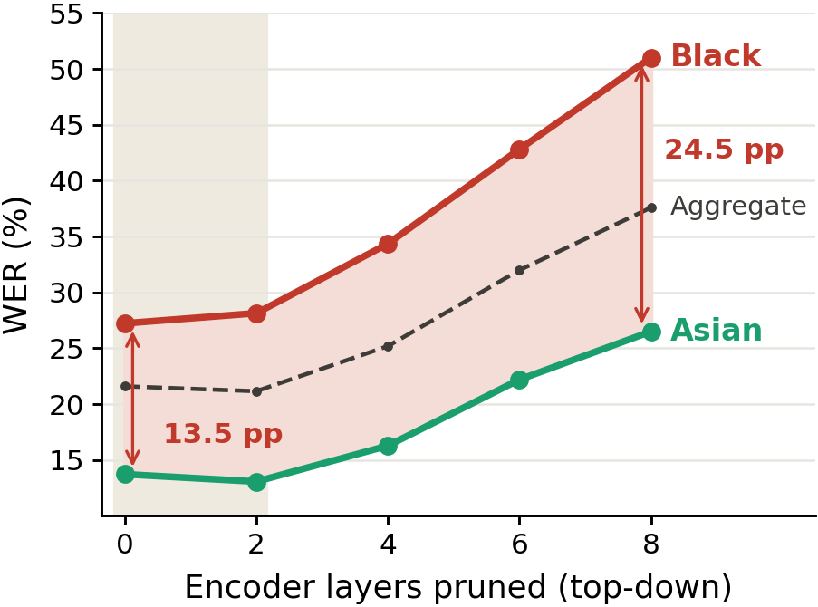
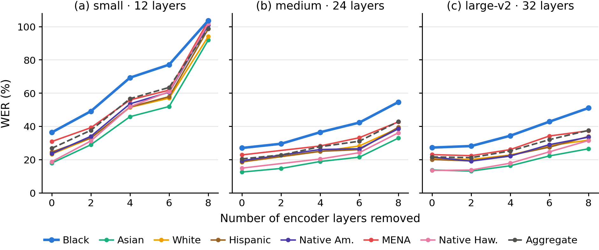
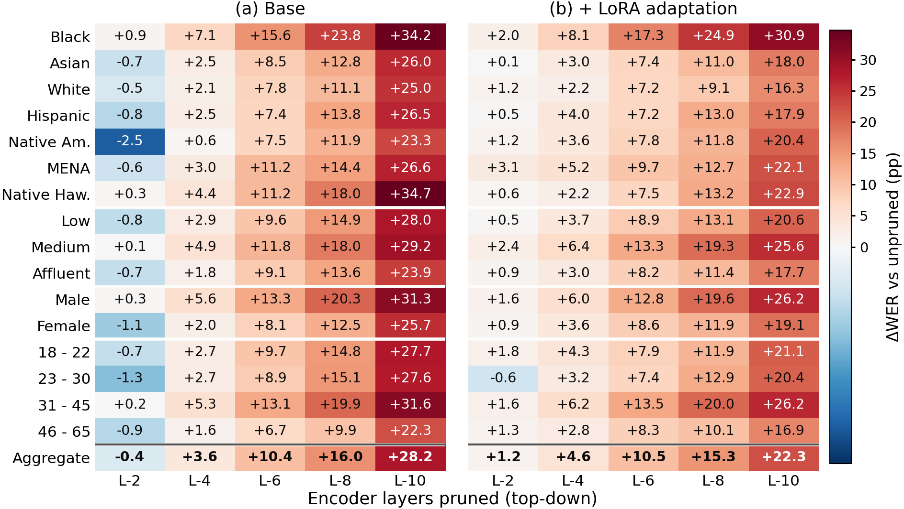

# Pruning for Efficiency, Paying in Fairness

Code for the paper *Pruning for Efficiency, Paying in Fairness: Demographic Disparities in Pruned Speech-LLMs*.

## Summary

Speech-LLMs are expensive to run, so compression is a routine step before deployment. Compressed models are normally validated on aggregate word error rate, a single number over the whole evaluation set. But speech recognition already performs unevenly across demographic groups, and an aggregate cannot say which group paid for a compression decision.

We measure what encoder pruning does to that unevenness. In a SLAM-ASR pipeline we remove Whisper encoder layers top-down, retrain the projector at every depth, select each configuration on aggregate WER, and only then score it separately for each demographic group. No group label enters training, pruning or model selection.

The study asks three questions:

- **RQ1.** Does encoder pruning amplify demographic disparities, and does aggregate WER hide it?
- **RQ2.** Does the effect depend on encoder scale and on the language's resource level?
- **RQ3.** Does LoRA adaptation recover performance equally across groups?

In short: the disparity is inherited rather than created by pruning. On the largest encoder the first pruning step improves the aggregate while significantly degrading the worst-performing group. That concealment does not happen at smaller scales, where the damage is visible in the aggregate straight away. LoRA improves every group's WER and still widens the gap, because it repairs the best-served groups most. On Common Voice English, Dutch and Danish the accent and gender gaps survive pruning but do not clearly widen. Aggregate WER therefore cannot validate a pruned speech model as fair, and deployment decisions for compressed models should report per-group WER with the worst-performing group as an explicit criterion.

## Experimental setup

**System.** A frozen Whisper encoder feeds a trainable ConcatLinear projector, which maps audio representations into a frozen Qwen2.5-3B decoder. The projector is a two-layer MLP: it concatenates five consecutive frames, projects through a 2048-unit hidden layer with ReLU and dropout 0.1, then applies LayerNorm so the audio embeddings match the scale of the LLM's text embeddings. Encoder capacity is the only variable. The encoder and LLM stay frozen; only the projector and, where enabled, the LoRA adapters are trained.

**Pruning protocol**, applied the same way at each encoder scale (Small 12 layers, Medium 24, Large-v2 32):

1. Train the projector on the unpruned encoder. This is the L-0 baseline.
2. Remove the top two encoder layers to reach depth L-*k*, for *k* in {2, 4, 6, 8}, and 10 on large-v2.
3. Retrain the projector from scratch at that depth, so every configuration is a deployable system rather than a mismatched stack probed after pruning.
4. Select on aggregate WER.
5. Decode the evaluation corpora and compute WER for each demographic group.

**Data.** Common Voice 22 supplies training and test splits. Fair-Speech is evaluation only and carries the richest demographic schema.

| Corpus | Split | Utterances | Bias axes |
|---|---|---|---|
| Common Voice English | train / test | 58,140 / 16,391 | accent, gender, age |
| Common Voice Dutch | train / test | 43,458 / 12,033 | accent, gender, age |
| Common Voice Danish | train / test | 3,592 / 2,684 | accent, gender, age |
| Fair-Speech | eval | 26,417 | ethnicity, SES, gender, age, L1 |

Audio is resampled to 16 kHz and converted to 80-channel log-Mel spectrograms following the Whisper pipeline. Utterances run 0.5 to 30 seconds. Transcriptions are lowercased with punctuation removed and apostrophes preserved.

**Training settings.** AdamW, learning rate 1e-4, weight decay 0.01, gradient clipping 1.0, cosine schedule with linear warmup over the first 5% of steps, bfloat16, seed 42, one 48 GB GPU. Settings are constant across scales and depths, so configurations differ only in encoder capacity. Batch size and epoch count follow the corpus:

| Language | Batch | Projector epochs | LoRA epochs | LoRA rank |
|---|---|---|---|---|
| English (100 h) | 8 | 2 | 4 | r=16, alpha=32 |
| Dutch (54 h) | 8 | 4 | 8 | r=16, alpha=32 |
| Danish (4.2 h) | 4 | 6 | 8 | r=8, alpha=16 |

LoRA is applied to the query, key, value and output projections of every LLM attention layer, dropout 0.1. Training stops early on validation WER, so model selection never involves a demographic label.

**Decoding.** Projected audio embeddings are prepended to a fixed plain-text prompt, `Transcribe speech to text.`, held constant across scales, depths and languages. Beam search of width 2, no sampling, no repetition or length penalty, up to 128 new tokens, the same for base and LoRA-adapted systems.

**Measures.** Worst-group WER at each depth is the primary measure. Alongside it we report the absolute gap (worst minus best, in percentage points) and the ratio between them as a scale-free check, since the two diverge when all groups degrade together. Significance comes from a paired resampling test over 2,000 bootstrap resamples of the evaluation set. Claims are limited to the usable range, the contiguous depths where aggregate WER stays at or below 40%. A group is analysed only when it has at least 200 utterances and 30 minutes of audio.

## Findings

### 1. Aggregate WER hides what pruning does to the worst-served group



On Whisper large-v2 evaluated on Fair-Speech, removing the top two encoder layers *improves* aggregate WER from 21.6% to 21.1% (p=.038). In that same configuration, Black speakers are the only group whose error rate rises significantly, by 0.9 pp (p=.009). Anyone watching the aggregate would record a small win at the depth where the worst-performing group got worse. By eight removed layers the Black-Asian gap has grown from 13.5 to 24.5 percentage points.

### 2. The concealment is specific to the largest encoder



The disparity is inherited at every scale. Before any pruning, Black speakers face roughly twice the word error rate of Asian speakers on all three encoders (ratio 2.03 small, 2.16 medium, 1.99 large-v2). What differs is whether the aggregate warns you. The first prune costs the small model 4.7 pp of aggregate WER and the medium model 2.3 pp, while large-v2 improves by 0.5 pp. The disparity ratio rises at the first prune only on large-v2, from 1.99 to 2.15. On small and medium it falls, because the better-served group loses proportionally more as both degrade sharply.

### 3. LoRA lowers everyone's error rate and still widens the gap



LoRA improves aggregate WER at every depth, from 21.6% to 17.7% unpruned and from 37.6% to 33.0% at eight removed layers, and it extends the usable pruning range by two more layers. The recovery is not evenly distributed. The Black-to-Asian ratio is wider with LoRA at every depth: 1.99 to 2.20 unpruned, 1.93 to 2.22 at eight removed layers. Adaptation compensates the best-performing groups more. At ten removed layers it recovers 8.0 pp for Asian speakers and 3.3 pp for Black speakers.

Outside Fair-Speech, the accent and gender gaps on Common Voice English and Dutch persist under pruning but do not clearly widen, and Danish is too degraded and too sparsely annotated for group-level conclusions. The fairness effect of pruning has to be measured per corpus, axis and model scale rather than assumed.

## Repository layout

```
datamodule/   Common Voice download and preprocessing, HF dataset builders
models/       Whisper encoder with layer pruning, projectors, SLAM-ASR model
utils/        WER/CER metrics, checkpointing, logging
configs/      Training and evaluation configs for the sweep
train.py      Projector-only and projector+LoRA training
eval.py       Corpus-level WER/CER for one configuration
scoring/      Per-utterance decoding and per-group WER with bootstrap CIs
```

## Installation

Python 3.10 or newer, one CUDA GPU.

```bash
uv sync
```

or:

```bash
pip install -e .
```

## Data

Build Common Voice 22 into the project's schema:

```bash
python -m datamodule.hf_data --language en --output-dir data/cv22_hf --max-hours 100
python -m datamodule.hf_data --language nl --output-dir data/cv22_hf
python -m datamodule.hf_data --language da --output-dir data/cv22_hf
```

The dataset lands in `data/cv22_hf/<language>`, which is what the configs expect. English is capped at 100 hours; Dutch and Danish use their full train splits.

Fair-Speech is evaluation only. Stage Meta's release under `data/fairspeech/` (`metadata.tsv` plus `audio/*.wav`), then build it:

```bash
python -m datamodule.hf_fairspeech --input_dir data/fairspeech --output_dir data/fairspeech_hf
```

Meta's terms prohibit redistributing the dataset or its derivatives. The built dataset and all per-utterance output stay under `data/` and `results/`, both gitignored. Summary-level metrics such as per-group WER may be published.

## Training

Each configuration trains a projector from scratch at one pruning depth:

```bash
python train.py --config configs/whisper_largev2/english/train/baseline.yaml
python train.py --config configs/whisper_largev2/english/train/ablation_30L.yaml
```

Config names give the number of encoder layers **kept**. On a 32-layer encoder, `ablation_30L.yaml` is the L-2 configuration with two layers removed. `LoRA/train/` holds the matching projector+LoRA configs.

## Evaluation

Corpus-level WER and CER for one configuration:

```bash
python eval.py --config configs/whisper_largev2/english/eval/ablation_30L.yaml
```

Per-utterance output and per-group WER with bootstrap confidence intervals:

```bash
python scoring/evaluate_subgroup_wer.py \
    --config configs/fairspeech/whisper_largev2/eval/ablation_30L.yaml \
    --checkpoint_path outputs/whisper_largev2/english/ablation_30L/checkpoint_best_wer.pt \
    --prune_depth 2 --seed 42 --condition fairspeech_d02_keep30 \
    --demographic_source hf_columns
```

This writes a per-utterance CSV (references, hypotheses, duration, demographic columns) to `results/per_utterance/` and per-group summaries to `results/per_group_wer/`.

Fair-Speech carries its demographic axes inline, so `--demographic_source hf_columns` reads them from the dataset. Common Voice drops them in preprocessing, so pass `--demographic_source cv22_tsv` with `--cv_test_tsv` pointing at the matching `transcript/<lang>/test.tsv`.

To run every depth of a sweep:

```bash
python scoring/run_depth_sweep.py --dataset fairspeech \
    --model_dir configs/fairspeech/whisper_largev2/eval \
    --checkpoint_root outputs/whisper_largev2/english
```

Condition labels become filenames, so give each corpus its own prefix. Two corpora evaluated at the same depth would otherwise overwrite each other's CSVs.

## Citation

```bibtex
@misc{kolluri2026pruning,
  title  = {Pruning for Efficiency, Paying in Fairness: Demographic Disparities in Pruned Speech-LLMs},
  author = {Kolluri, Ganesh Pavan Kartikeya Bharadwaj and Kampouridis, Michael and Shekhar, Ravi},
  year   = {2026},
  note   = {School of Computer Science and Electronic Engineering, University of Essex}
}
```

## License

Apache License 2.0. See [LICENSE](LICENSE).
